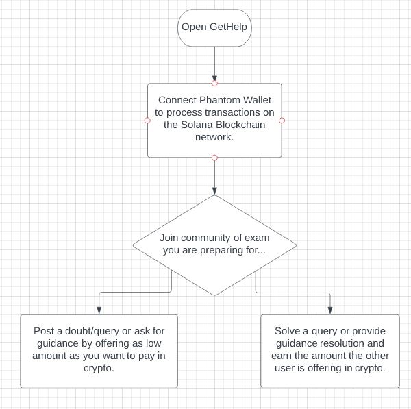

# Team Name: 
**HackCrew JH**
# Team Members: 
**Ahzam Akhtar, Mohd Yahya and Ali Khan**
# Problem Statement: 
**Cost effective, customized, faster and safer solution to competitive exam preparation.**
# Our Solution: 
**"GetHelp" A decentralized platform for competetive exam guidance and doubt solving.**
* Our platform allows aspirants to join any competitive exam-community depending on the exam they are preparing for and post there doubts, queries and guidance resolutions for which they can pay as low as they want in crypto.
* On publishing a doubt, an automated mail will be sent to all the community members so that it can be resolved as soon as possible.
* On the other hand, they can even solve other member’s doubts for earning crypto that the other member is willing to pay. 
* Our project tries to compete with the huge Coaching Industry with our One-to-One community platform solution that runs on Solana BlockChain Network.
# Tech Stack Used: 
**NextJS, Rust, Anchor Framework, TailwindCSS, Solana and Replit.**
# Github Repository Link:
**https://github.com/YTW7/get_help_v2**
# Video Link Explaining the Project and working: 
**https://youtu.be/j3nj_Uia5Xg**
# Prize Tracks Covered: 
**Solana and Replit**
# Replit Link:
**https://replit.com/@YTW7/GetHelp?v=1**
# Information Architecture:

# Snippets of Our Project:

